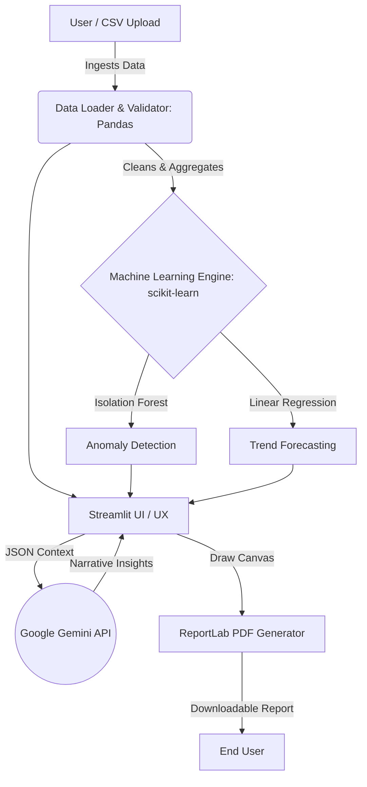
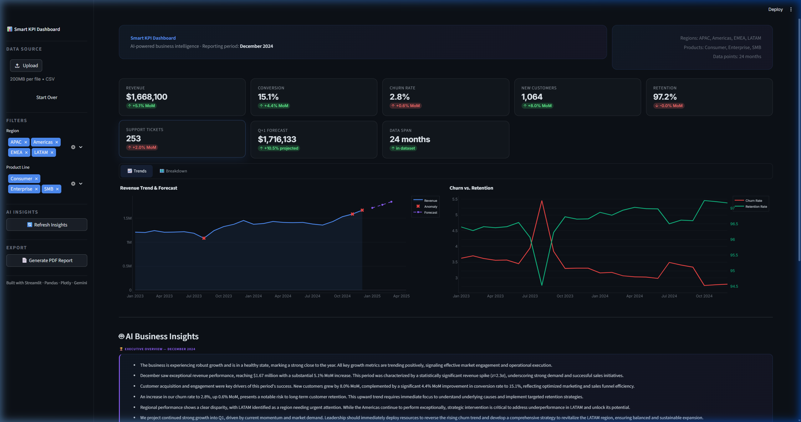
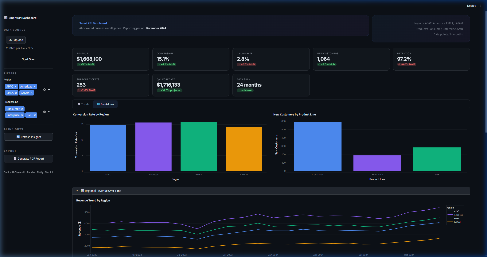

# Smart KPI Dashboard – Summary Deck

---

## PROBLEM UNDERSTANDING AND OBJECTIVE

**The Problem:**
Modern executives and stakeholders are often overwhelmed by raw data. Traditional dashboards present numbers and charts but fail to provide immediate context, requiring manual analysis to discover "the why" behind the metrics.

**Our Objective:**
To build a professional-grade, AI-powered business intelligence dashboard that bridges the gap between raw data and executive decision-making. 

**Key Goals:**
- **Automated Ingestion:** Seamlessly process structured CSV data containing core KPIs (Revenue, Conversion, Churn, etc.).
- **Intelligent Analysis:** Automatically detect anomalies and forecast future trends using machine learning.
- **Actionable Context:** Leverage Generative AI (Google Gemini) to synthesize complex data into lucid, executive-ready business narratives.
- **Exportable Reporting:** Generate physical artifacts (PDFs) for offline stakeholder review.

---

## SOLUTION ARCHITECTURE AND DESIGN FLOW

**Workflow & Data Flow**



**Major Components:**
- **Frontend:** Streamlit (Custom CSS, state management, interactive Plotly charts).
- **Data Engine:** Pandas (MoM calculations, time-series aggregation).
- **ML Layer:** Scikit-learn (IsolationForest, LinearRegression).
- **AI Engine:** Google Gemini 1.5 Flash (LLM prompt engineering).
- **Export:** ReportLab (Automated PDF reporting).

---

## IMPLEMENTATION HIGHLIGHTS

**1. Robust State Management**
Implemented an "all-or-nothing" session state clearing mechanism. Whenever a user uploads a new dataset or clicks "Start Over", all downstream dependencies (regional filters, AI cache) are strictly cleared to prevent stale data crashes.

**2. Executive UI / UX Polish**
Designed a premium interface using custom CSS (glassmorphism, gradient text). Replaced clunky static anomaly cards with dynamic, context-aware tooltips directly injected into the Plotly charts, saving vertical space and improving scannability.

*(Dashboard Screenshots)*



**3. Deterministic AI Prompting**
Engineered structured prompts that feed Gemini raw, calculated JSON data alongside strict formatting instructions to ensure insights are delivered in punchy, business-focused bullet points.

*Code Highlight (Custom Markdown Parser for AI UI):*
```python
# Custom regex to ensure Gemini's markdown bolding renders correctly in our custom HTML containers
formatted_text = re.sub(r'\*\*(.*?)\*\*', r'<strong>\1</strong>', text)
formatted_text = formatted_text.replace("- ", "<li>").replace("\n", "<br>")
```

---

## CHALLENGES AND LEARNINGS

**Technical Challenges & Trade-offs:**
- **Markdown Injection in Streamlit:** Rendering Gemini's markdown directly inside custom styled `<div>` containers caused bolding (`**`) to break. *Solution:* Built a lightweight regex parser to convert markdown to standard HTML tags before injection.
- **Layout Constraints:** Displaying AI commentary, charts, and data filters simultaneously risked overwhelming the user. *Trade-off:* Removed standalone anomaly alert boxes in favor of interactive red "x" markers on the chart with hover-explanations.
- **State Syncing:** Streamlit's reactive execution model caused filter mismatched errors when swapping datasets. *Solution:* Centralized state reset logic in the file uploader callbacks.

**Key Takeaways:**
Combining deterministic Machine Learning (scikit-learn for strict anomaly math) with Generative AI (Gemini for human-readable context) creates a highly trusted, "best of both worlds" analytical workflow.

---

## DEMO SUMMARY AND NEXT STEPS

**Final Solution Summary:**
A production-ready, highly interactive Streamlit application that transforms raw synthetic operations data into an executive performance suite. The dashboard successfully handles automated data validation, trend forecasting, AI narrative generation, and PDF report exporting.

**Potential Enhancements (With more time):**
1. **Direct Database Integrations:** Replace the CSV-only upload with direct connectors to SQL databases, Snowflake, or BigQuery.
2. **User-Defined Schema Mapping:** Allow users to upload datasets with varying column names and map them to the required KPI schema via a visual UI.
3. **Advanced AI Caching:** Implement MD5 hashing on the dataset and filter states. By caching Gemini API responses for identical data states, we could significantly reduce latency and API costs.
4. **Auth & RBAC:** Implement user authentication to restrict access to sensitive financial data.
